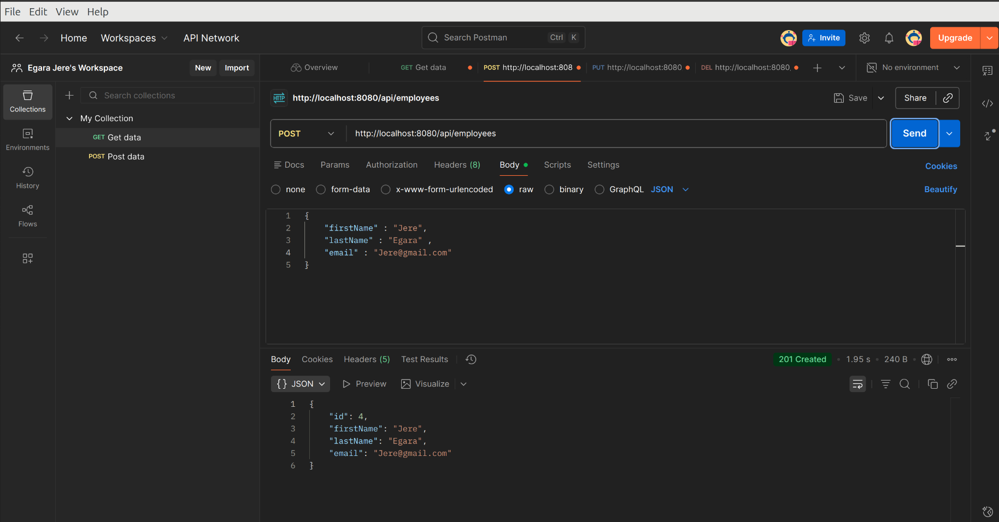
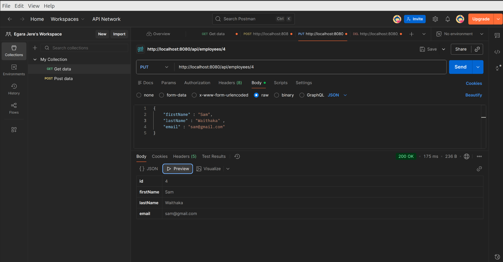

# Employee Management System

A simple Employee Management System built using Java, Spring Boot, REST APIs, and PostgreSQL.  
This project demonstrates CRUD (Create, Read, Update, Delete) operations and database integration using RESTful web services.

---

## Features

- Create Employee Records
- Retrieve Employee Information
- Update Existing Employees
- Delete Employees
- REST API Architecture
- PostgreSQL Database Integration
- Layered Spring Boot Project Structure

---

## Technologies Used

- Java
- Spring Boot
- Spring Web
- Spring Data JPA
- PostgreSQL
- Maven
- REST APIs
- Postman (for API testing)

---

## Project Structure

```bash
src/
 ├── main/
 │   ├── java/
 │   │    └── com/example/employeesystem/
 │   │          ├── controller/
 │   │          ├── service/
 │   │          ├── repository/
 │   │          ├── entity/
 │   │          └── EmployeeManagementApplication.java
 │   └── resources/
 │         └── application.properties
```

---

## Setup Instructions

### 1. Clone the Repository

```bash
git clone https://github.com/egarajere-png/EmployerManagementSystem.git
```

---

### 2. Open the Project

Open the project in:

- Spring Tool Suite (STS)
- IntelliJ IDEA
- VS Code

---

### 3. Configure PostgreSQL

Create a PostgreSQL database:

```sql
CREATE DATABASE employee_db;
```

Update your `application.properties` file:

```properties
spring.datasource.url=jdbc:postgresql://localhost:5432/employee_db
spring.datasource.username=your_username
spring.datasource.password=your_password

spring.jpa.hibernate.ddl-auto=update
spring.jpa.show-sql=true
spring.jpa.properties.hibernate.dialect=org.hibernate.dialect.PostgreSQLDialect
```

---

### 4. Run the Application

Using Maven:

```bash
./mvnw spring-boot:run
```

Or run the main Spring Boot application class directly from your IDE.

---

## API Endpoints

| Method | Endpoint | Description |
|--------|----------|-------------|
| GET | `/employees` | Retrieve all employees |
| GET | `/employees/{id}` | Retrieve employee by ID |
| POST | `/employees` | Create new employee |
| PUT | `/employees/{id}` | Update employee |
| DELETE | `/employees/{id}` | Delete employee |

---

## Testing APIs

You can test the APIs using:

- Postman
- Thunder Client
- cURL

Example POST request body:

```json
{
  "name": "John Doe",
  "department": "IT",
  "salary": 50000
}
```

---

## Learning Objectives

This project was built to practice and understand:

- REST API development
- Spring Boot fundamentals
- PostgreSQL database integration
- CRUD operations
- Git and GitHub workflow
- Backend application structure

---

## Future Improvements

- Add frontend interface
- Implement authentication & authorization
- Add validation and exception handling
- Dockerize the application
- Deploy to cloud platforms

---

## Author

Egara Jere

GitHub Repository:  
https://github.com/egarajere-png/EmployerManagementSystem

---

## 📸 Project Screenshots

### 🔹 Post Image



---

### 🔹 Get Image


---

### 🔹 Update Image



---

### 🔹 Delete Image


